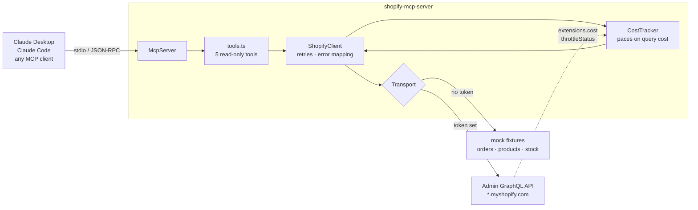

# shopify-mcp-server

Let Claude answer "which orders are stuck and what is out of stock?" against a real Shopify store, without giving it the ability to change anything.

An [MCP](https://modelcontextprotocol.io) server exposing five read-only tools over Shopify's Admin GraphQL API. Runs on demo fixtures out of the box, so you can try it in about a minute with no Shopify account.

```
npm install && npm run build && npm start
```

## Why this exists

I run fulfilment for two live storefronts and built the warehouse picking system behind them. The question I actually ask the data, several times a week, is boring and repetitive: *which orders are unfulfilled and older than two days, and is the thing they are waiting on in stock anywhere?*

That is three clicks in Shopify admin, times however many stores. It is a good question for an agent and a bad use of a person. But the obvious way to wire an LLM to a storefront is to hand it an API token with write scopes, and the failure mode there is somebody's real order getting cancelled by a model that misread a prompt.

So: read-only by construction, mock mode by default, and the rate limiting done properly because agents fire tool calls in bursts.

## Architecture



## Quick start

```bash
git clone https://github.com/krunalp2801/shopify-mcp-server
cd shopify-mcp-server
npm install
npm test          # 29 tests, no credentials needed
npm run build
npm start         # starts in MOCK mode
```

### Connect it to Claude

Add to your MCP client config (Claude Desktop: `claude_desktop_config.json`; Claude Code: `.mcp.json`):

```json
{
  "mcpServers": {
    "shopify": {
      "command": "node",
      "args": ["/absolute/path/to/shopify-mcp-server/dist/src/index.js"]
    }
  }
}
```

Then ask: *"Using the shopify tools, what is out of stock and which orders are waiting on it?"*

### Point it at a real store

Copy `.env.example` to `.env` and fill in:

```bash
SHOPIFY_SHOP=your-store          # or the full your-store.myshopify.com
SHOPIFY_ACCESS_TOKEN=shpat_...   # custom app token
```

The app needs `read_orders`, `read_products` and `read_inventory`. Nothing more — the server cannot write even if you grant more.

### Tools

| Tool | What it answers |
|---|---|
| `shopify_shop_info` | Which store is this, what currency, and am I on live data or fixtures? |
| `shopify_list_orders` | Recent orders, filterable with Shopify search syntax |
| `shopify_get_order` | One order in full, with line items and shipping address |
| `shopify_list_products` | Products with status and total inventory |
| `shopify_inventory_levels` | Stock per variant per location; `belowQuantity` finds restocks |

## Design decisions

**Read-only, enforced in the shape of the thing.** Every tool carries `readOnlyHint: true` and there is no mutation path in the code. This is a limit, not a gap. An agent that can cancel orders needs a human approval step in front of it, and that is a different project with a different risk profile.

**Pace on query cost, don't wait for a 429.** Shopify's GraphQL API is not rate-limited by request count. It uses a leaky bucket measured in *query cost*, and every response reports what the query cost and how much bucket is left. A client that only reacts to 429s spends its life being throttled. `CostTracker` reads `extensions.cost.throttleStatus` and sleeps *before* the next call when the bucket is low. This matters more for agents than for apps: an agent will happily fire eight tool calls in a row with no sense of pacing.

**Mock mode is the default, not a test harness.** No token means fixtures, automatically. Evaluating a repo should not require creating a Shopify dev store, and the fixtures are deliberately untidy — a partial refund, an order blocked on a restock, a variant out of stock in one location but not the other. A demo where everything is clean teaches you nothing about the data.

**Transport is injected.** `ShopifyClient` takes a `Transport`, so tests drive it with scripted responses and mock mode swaps in fixtures. No stubbing of global `fetch`, and the retry and throttle paths are tested directly rather than inferred.

**Errors are returned, not thrown.** A failed Shopify call comes back as a tool result with `isError: true` and a message naming the likely cause. An agent can read that and change course; an exception just ends the turn.

**Two runtime dependencies.** The MCP SDK and zod. Tests use Node's built-in runner, no framework. Given how much of the npm supply chain an MCP server sits in front of, every dependency here has to earn its place.

### Trade-offs

- **Flattening inventory to one row per variant-location loses the nesting.** Worth it: "how many, and where" is the question a restock decision needs, and a nested shape makes the model walk the tree itself, badly.
- **`shopify_get_order` accepts an order *name* like `#1042`.** Fixtures resolve it; against a live store you need an id, because Shopify's API has no direct name lookup. The alternative was rejecting a format humans actually use.
- **Page size is capped at 50.** Agents ask for everything. The cap protects both the cost bucket and the context window.
- **The cost estimate for the next query is the last query's actual cost.** Shopify only tells you after the fact. It is wrong on the first call of a new shape and self-corrects immediately.

## What is next

- A `shopify_unfulfilled_backlog` tool that composes orders and inventory into the restock question directly, instead of making the agent join two calls.
- Cursor-based auto-pagination behind a result cap.
- Webhook-fed cache so repeated questions do not re-spend query cost.
- An opt-in write tier behind explicit human approval: tag an order, add a note.

## Development

```bash
npm test          # typecheck + 29 tests
npm run typecheck
npm run build
```

Tests run on Node's type stripping, so the source avoids TypeScript syntax that needs a real transform — notably parameter properties.

MIT licensed.

---

Built by Krunal Patel, part of the Weekly Build series. More at https://www.krunal.de
